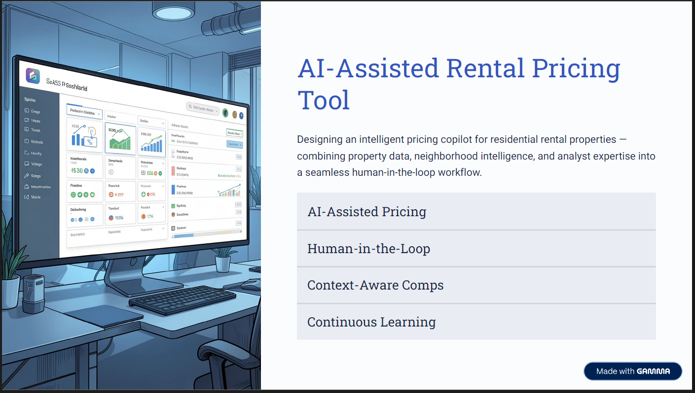
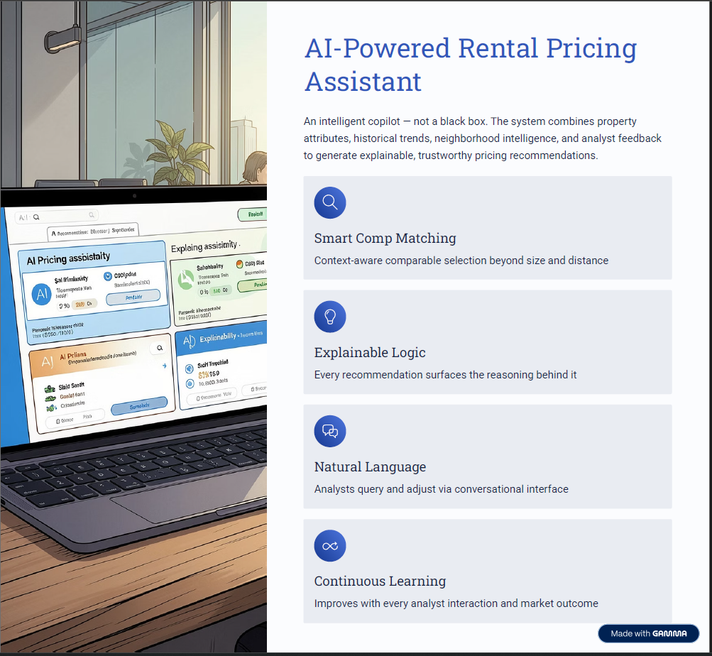
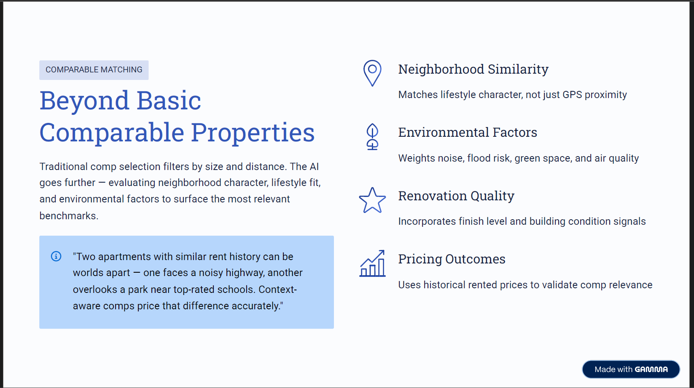
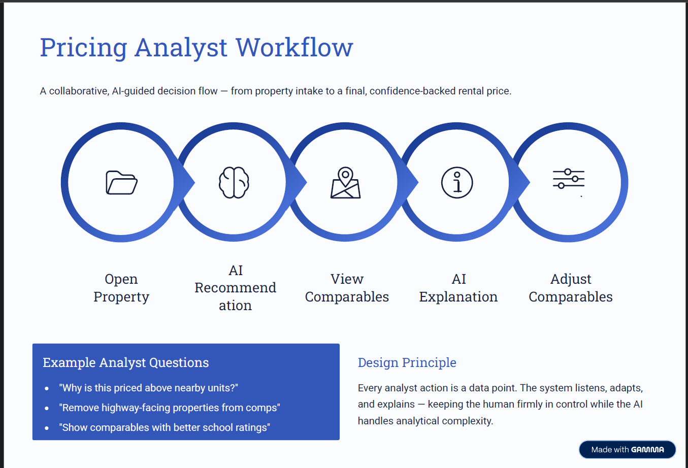
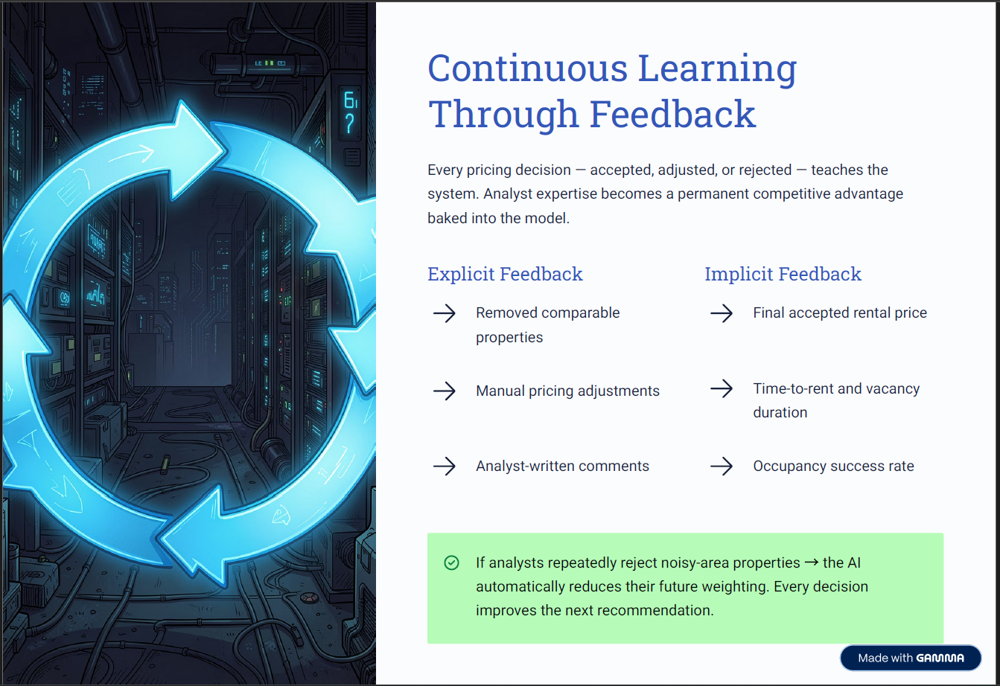

# AI-Assisted Rental Pricing Tool

## Live Prototype
[View Prototype](https://property-clairvoyant.lovable.app/)

An AI-powered rental pricing copilot designed for residential rental companies to generate more accurate, explainable, and context-aware pricing recommendations.

The system combines:
- Property attributes
- Historical rental trends
- Neighborhood intelligence
- Analyst feedback

to create a human-in-the-loop pricing workflow that continuously improves over time.

---

# Overview

Traditional rental pricing systems rely heavily on:
- Fixed pricing rules
- Nearby comparable properties
- Manual analyst adjustments

This approach often ignores important real-world factors such as:
- School quality
- Road noise
- Flood risk
- Walkability
- Green spaces
- Neighborhood appeal

As a result, two properties with similar size and location can receive identical pricing guidance despite having very different desirability.

---

# Cover Overview

---

# Proposed Solution

The proposed system acts as an intelligent pricing assistant rather than a black-box automation tool.

Core capabilities include:
- Context-aware comparable property matching
- AI-generated rental price recommendations
- Explainable pricing logic
- Natural language analyst interaction
- Continuous feedback learning

The goal is to help pricing analysts make faster, smarter, and more consistent pricing decisions.

---

# AI Pricing Assistant

Displays:
- AI-generated rental recommendation
- Comparable property selection
- Explainable pricing logic
- Confidence-backed recommendations

---

# Key Features

## Smart Comparable Matching
Moves beyond distance and size-based matching by incorporating:
- Neighborhood similarity
- Environmental factors
- Lifestyle fit
- Renovation quality
- Historical pricing outcomes

---

## Explainable AI Recommendations
Every pricing recommendation includes transparent reasoning.

Example:
“This property is priced higher due to better school ratings, lower flood risk, and stronger walkability scores.”

---

## Natural Language Interaction
Analysts can interact conversationally with the system.

Example prompts:
- “Remove highway-facing properties”
- “Show comps with better school ratings”
- “Why is this priced above nearby units?”

---

## Continuous Learning
The system improves using:
- Analyst adjustments
- Removed comparables
- Accepted/rejected recommendations
- Rental outcomes and occupancy trends

Every analyst interaction becomes a learning signal for future recommendations.

---

# Multi-Layer Data Intelligence

The AI engine combines three core data sources:

## 1. Property Data
Bedrooms, bathrooms, square footage, furnishing, amenities, building age, parking

## 2. Historical Rental Data
Previous rental prices, occupancy trends, lease duration, adjustment history

## 3. Location Intelligence
School ratings, crime, flood risk, walkability, transport access, noise levels

---

# Comparable Matching Engine

The system evaluates:
- Neighborhood similarity
- Environmental quality
- Historical pricing behavior
- Lifestyle compatibility
- Renovation quality

This allows the AI to identify more contextually relevant comparable properties instead of relying only on geographic proximity.

---

# Pricing Analyst Workflow

The pricing analyst remains in control while the AI handles analytical complexity.

Workflow:
Property Intake
↓
AI Recommendation
↓
Comparable Review
↓
AI Explanation
↓
Analyst Adjustments
↓
Updated Recommendation
↓
Feedback Stored for Learning

Example analyst prompts:
- “Remove highway-facing properties”
- “Why is this priced higher?”
- “Show better school district comparables”

---

# Continuous Learning Through Feedback

The system continuously improves using both explicit and implicit analyst feedback.

## Explicit Feedback
- Removed comparable properties
- Manual pricing adjustments
- Analyst-written comments

## Implicit Feedback
- Final accepted rental price
- Time-to-rent
- Vacancy duration
- Occupancy success rate

Example:
If analysts repeatedly reject noisy-area properties, the AI automatically reduces their future weighting.

---

# Success Metrics

## Pricing Accuracy
- Prediction error vs final rented price
- Comparable relevance score

## Analyst Efficiency
- Faster pricing decisions
- Reduction in manual adjustments

## Adoption & Trust
- Recommendation acceptance rate
- AI explanation usage frequency

## Business Impact
- Faster occupancy
- Reduced vacancy duration
- Improved rental yield

---

# Prototype

This prototype demonstrates:
- AI-assisted pricing recommendations
- Comparable property exploration
- Explainable pricing workflows
- Analyst feedback interactions
- Continuous learning systems

Built using AI-assisted design workflows for product exploration and UX demonstration purposes.

---

# Future Improvements

Potential future enhancements:
- Real-time market demand forecasting
- Satellite/street-view intelligence
- Voice-based analyst interaction
- Dynamic pricing simulation
- Tenant persona matching

---

# Final Takeaway

This project transforms rental pricing from static rule-based workflows into an intelligent, explainable, and continuously learning pricing system.

The core differentiator is the combination of:
- AI-powered contextual pricing
- Human analyst oversight
- Explainable recommendations
- Continuous feedback learning

Better pricing decisions through smarter data, explainable AI, and human-in-the-loop collaboration.
